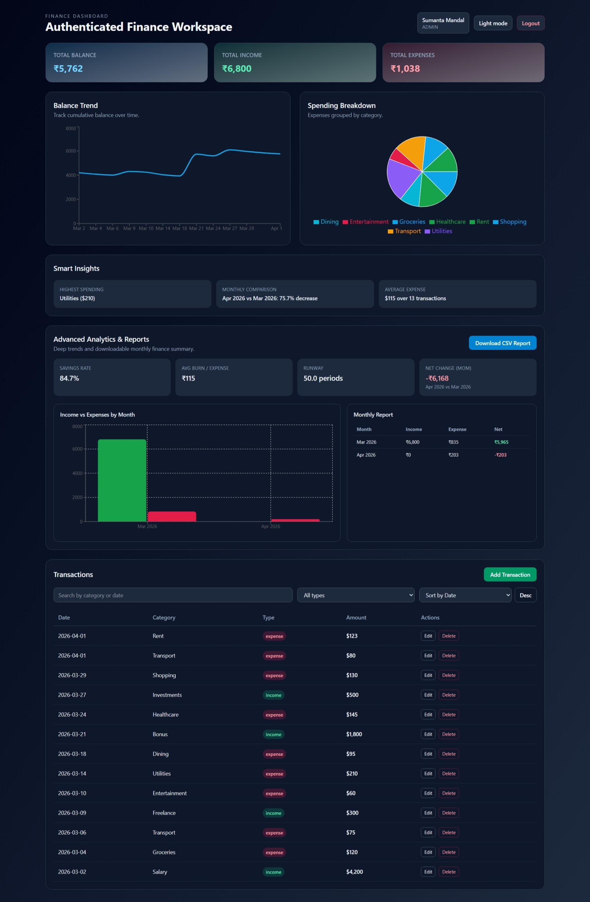

# 💰 Personal Finance Dashboard

A clean and interactive **Finance Dashboard UI** built using React and Tailwind CSS.
This project allows users to track their financial activity, visualize spending patterns, and manage transactions efficiently.

---

## 🚀 Live Demo

👉 https://enginnersumanta.github.io/finance-dashboard/

---

## 📸 Preview

👉 

---

## ✨ Features

### 📊 Dashboard Overview

* Summary cards for:

  * Total Balance
  * Total Income
  * Total Expenses
* Line chart for balance trend
* Pie chart for spending breakdown

### 📋 Transactions Management

* View all transactions with:

  * Date
  * Amount
  * Category
  * Type (Income / Expense)
* Search transactions
* Filter (Income / Expense)
* Sort by date and amount

### 🔐 Role-Based UI

* **Viewer**

  * Can only view data
* **Admin**

  * Can add, edit, and delete transactions
* Role switching via dropdown

### 📈 Insights Section

* Highest spending category
* Monthly comparison
* Smart financial observations

---

## 🧠 Tech Stack

* **Frontend:** React (Vite)
* **Styling:** Tailwind CSS
* **Charts:** Recharts
* **State Management:** Context API
* **Data:** Mock data (no backend)

---

## 🏗️ Project Structure

```
src/
 ├── components/
 │   ├── SummaryCard.jsx
 │   ├── TransactionTable.jsx
 │   ├── Charts.jsx
 │   ├── Insights.jsx
 │   ├── RoleSwitcher.jsx
 │   ├── TransactionModal.jsx
 │
 ├── context/
 │   ├── FinanceContext.jsx
 │   └── useFinance.js
 │
 ├── data/
 │   └── mockData.js
 │
 ├── pages/
 │   └── Dashboard.jsx
 │
 ├── App.jsx
 └── main.jsx
```

---

## 🧩 Approach

* Built using **component-based architecture**
* Managed global state with **Context API**
* Used **mock data** to simulate real-world transactions
* Focused on **clean UI, usability, and responsiveness**

---

## 🌙 Optional Features Implemented

* Dark mode support 🌙
* Local storage persistence 💾
* Modal for adding/editing transactions ➕

---

## 📱 Responsiveness

* Fully responsive design
* Works on:

  * Mobile 📱
  * Tablet 📲
  * Desktop 💻

---

## 🧪 Future Improvements

* Backend integration (Node.js / Firebase)
* Export data (CSV / PDF)

---

## 🙌 Author

**Your Name**
Frontend Developer (React)

* GitHub: https://enginnersumanta
* LinkedIn: www.linkedin.com/in/sumanta-mandal-80768123b

---

## ⭐ If you like this project

Give it a ⭐ on GitHub and share your feedback!
